# Life-Toolkit Enhancement Plan

## App Rename
- **English**: Life-Toolkit
- **Persian**: جعبه‌ابزار زندگی

---

## Overview of Changes

This plan covers 14 phases of enhancements to the self-monitoring app, transforming it into a professional, beautiful, and feature-rich personal life management tool.

---

## Architecture Diagram

```mermaid
graph TB
    subgraph New Sections
        D[Debts and Obligations<br/>دین‌ها و بدهکاری‌ها]
        B[Birthdays<br/>تولدها]
    end

    subgraph UI Enhancements
        G[Glassmorphism<br/>shadcn-style]
        A[Animations<br/>framer-motion]
        C[Charts<br/>Dashboard]
    end

    subgraph Localization
        P[Persian Numbers]
        R[RTL Calendar]
        F[Font System]
    end

    subgraph Core Updates
        N[Navigation]
        S[Settings]
        T[Types and Storage]
    end

    T --> D
    T --> B
    N --> D
    N --> B
    S --> F
    G --> C
    A --> G
    P --> R
```



---

## Phase 1: New Data Types & Storage

### Files to modify:
- [`src/types/index.ts`](src/types/index.ts)
- [`src/lib/storage.ts`](src/lib/storage.ts)
- [`src/contexts/AppContext.tsx`](src/contexts/AppContext.tsx)

### New Types to Add:

```typescript
// Debt/Obligation Types
export type DebtType = 'material' | 'spiritual';
export type MaterialDebtCategory = 'borrowed-money' | 'lent-money' | 'borrowed-item' | 'lent-item';
export type SpiritualObligationType = 'qaza-namaz' | 'nazr' | 'kaffarah' | 'zakat' | 'khums' | 'other';

export interface MaterialDebt {
  id: string;
  type: 'borrowed' | 'lent';
  category: MaterialDebtCategory;
  amount?: number;
  itemDescription?: string;
  personName: string;
  description?: string;
  date: string;
  dueDate?: string;
  isPaid: boolean;
  paidDate?: string;
  notes?: string;
  createdAt: string;
}

export interface SpiritualObligation {
  id: string;
  type: SpiritualObligationType;
  title: string;
  description?: string;
  quantity?: number;
  unit?: string;
  isFulfilled: boolean;
  fulfilledDate?: string;
  notes?: string;
  createdAt: string;
}

// Birthday Types
export interface Birthday {
  id: string;
  name: string;
  date: string; // ISO date string
  calendarType: 'jalali' | 'gregorian';
  relation?: string;
  notes?: string;
  reminderDaysBefore: number[];
  createdAt: string;
}

// Font Settings
export type PersianFont = 'vazirmatn' | 'iran-sans' | 'sahel' | 'shabnam' | 'estedad';
export type EnglishFont = 'inter' | 'geist' | 'plus-jakarta-sans';
```

### Storage Migration (version 4 & 5):
- Version 4: Add `debts` and `spiritualObligations` arrays to AppState
- Version 5: Add `birthdays` array to AppState
- Version 6: Add `fontSettings` to UserSettings

---

## Phase 2: Debts & Obligations Section

### New file: [`src/sections/Debts.tsx`](src/sections/Debts.tsx)

### Features:
1. **Two tabs**: Material Debts | Spiritual Obligations
2. **Material Debts tab**:
   - Add/edit/delete debts
   - Filter by: borrowed/lent, paid/unpaid
   - Summary cards: total owed, total lent, overdue
   - Mark as paid with date
   - Person name + amount/item + due date
3. **Spiritual Obligations tab**:
   - Categories: قضا نماز, نذر, کفاره, زکات, خمس, سایر
   - Quantity tracking (e.g., "15 prayers remaining")
   - Mark as fulfilled
   - Progress tracking

### UI Design:
- Glassmorphism cards
- Color coding: red for overdue, green for paid, amber for upcoming
- Animated list with framer-motion

---

## Phase 3: Birthdays Section

### New file: [`src/sections/Birthdays.tsx`](src/sections/Birthdays.tsx)

### Features:
1. **Birthday list** with upcoming birthdays highlighted
2. **Add birthday** with Jalali/Gregorian date support
3. **Reminder settings**: 1 day, 3 days, 7 days before
4. **Relation categories**: Family, Friend, Colleague, Other
5. **Age calculation** (if birth year provided)
6. **Upcoming birthdays widget** for Dashboard
7. **Calendar integration** - show birthdays on calendar

### UI Design:
- Card-based layout with avatar/initials
- Countdown to next birthday
- Confetti animation on birthday day
- Color-coded by relation type

---

## Phase 4: App Rename

### Files to modify:
- [`src/contexts/LanguageContext.tsx`](src/contexts/LanguageContext.tsx) - Update `appName` translations
- [`src/App.tsx`](src/App.tsx) - Update logo/brand text
- [`index.html`](index.html) - Update `<title>` tag
- [`src/sections/Settings.tsx`](src/sections/Settings.tsx) - Update export filename

### Changes:
- English: `TaskFlow` → `Life-Toolkit`
- Persian: `تسک‌فلو` → `جعبه‌ابزار زندگی`
- Export filename: `taskflow-backup-*.json` → `life-toolkit-backup-*.json`

---

## Phase 5: Persian Font System

### Files to modify:
- [`src/index.css`](src/index.css) - Add Google Fonts imports for all fonts
- [`src/types/index.ts`](src/types/index.ts) - Add font types
- [`src/contexts/AppContext.tsx`](src/contexts/AppContext.tsx) - Add font to settings
- [`src/sections/Settings.tsx`](src/sections/Settings.tsx) - Add font picker UI

### Persian Fonts to Add:
| Font | Google Fonts URL | Style |
|------|-----------------|-------|
| Vazirmatn | ✅ Already imported | Modern, clean |
| Iran Sans | CDN | Traditional |
| Sahel | CDN | Rounded, friendly |
| Shabnam | CDN | Compact |
| Estedad | Google Fonts | Variable weight |

### Implementation:
```css
/* Dynamic font application via CSS variable */
:root {
  --persian-font: 'Vazirmatn', sans-serif;
}

body[dir="rtl"] {
  font-family: var(--persian-font);
}
```

### Settings UI:
- Font preview cards showing sample Persian text
- Live preview when hovering
- Saved to localStorage

---

## Phase 6: Persian Number Optimization

### Files to modify:
- [`src/contexts/LanguageContext.tsx`](src/contexts/LanguageContext.tsx) - Enhance `toPersianNum`
- All section files that display numbers

### Current Issue:
The `toPersianNum` function exists but is not consistently applied across all sections.

### Fix Strategy:
1. Create a utility hook `useNumbers()` that auto-converts based on language setting
2. Apply to: dates, amounts, counts, percentages, durations
3. Ensure Arabic-Indic numerals (۰-۹) are used when Persian is active

---

## Phase 7: Calendar RTL Fix

### Files to modify:
- [`src/sections/CalendarView.tsx`](src/sections/CalendarView.tsx)
- [`src/lib/calendar.ts`](src/lib/calendar.ts)
- [`src/components/ui/calendar.tsx`](src/components/ui/calendar.tsx)

### Issues to Fix:
1. Week starts on Saturday for Jalali (not Sunday)
2. Month navigation arrows should be mirrored in RTL
3. Day names should be right-aligned
4. Grid direction should be RTL
5. Month/year display should use Persian numbers

### Implementation:
```tsx
// CalendarView.tsx
<div dir={calendar === 'jalali' ? 'rtl' : 'ltr'} className="calendar-grid">
  {/* Week days header */}
  {weekDays.map(day => (
    <div className="text-center">{day}</div>
  ))}
</div>
```

---

## Phase 8: Eisenhower Matrix Colors

### File to modify:
- [`src/sections/Tasks.tsx`](src/sections/Tasks.tsx)

### New Color Scheme:
| Quadrant | Current | New | Meaning |
|----------|---------|-----|---------|
| Do First (Urgent + Important) | Red | 🔴 Red `#ef4444` | Critical action |
| Schedule (Important, Not Urgent) | Amber | 🔵 Blue `#3b82f6` | Strategic planning |
| Delegate (Urgent, Not Important) | Yellow | 🟠 Orange `#f97316` | Delegation |
| Eliminate (Neither) | Gray | 🟢 Green `#22c55e` | Low priority/eliminate |

### Changes:
```typescript
const quadrants = [
  { id: 'doFirst', color: '#ef4444', bgColor: 'rgba(239, 68, 68, 0.1)', borderColor: 'border-red-500/30' },
  { id: 'schedule', color: '#3b82f6', bgColor: 'rgba(59, 130, 246, 0.1)', borderColor: 'border-blue-500/30' },
  { id: 'delegate', color: '#f97316', bgColor: 'rgba(249, 115, 22, 0.1)', borderColor: 'border-orange-500/30' },
  { id: 'eliminate', color: '#22c55e', bgColor: 'rgba(34, 197, 94, 0.1)', borderColor: 'border-green-500/30' },
];
```

---

## Phase 9: Dashboard Charts Enhancement

### File to modify:
- [`src/sections/Dashboard.tsx`](src/sections/Dashboard.tsx)

### New Charts to Add:


### Chart Details:
1. **Life Balance Radar** - 8 dimensions: Health, Finance, Learning, Habits, Tasks, Meditation, Goals, Social
2. **Activity Heatmap** - GitHub-style contribution graph for habits/tasks
3. **Daily Score Gauge** - Circular progress showing today's overall score
4. **Trend Area Chart** - 30-day rolling average for key metrics
5. **Expense Donut** - Enhanced pie with center total
6. **Habit Streak Bars** - Horizontal bar chart sorted by streak

### Implementation using Recharts:
- `RadarChart` + `Radar` for life balance
- Custom SVG for heatmap
- `RadialBarChart` for gauge
- `AreaChart` for trends

---

## Phase 10: Glassmorphism & Minimalism UI

### Files to modify:
- [`src/index.css`](src/index.css) - Enhanced glass variables and utilities
- [`src/App.css`](src/App.css) - Sidebar and layout glass effects
- [`src/App.tsx`](src/App.tsx) - Apply glass classes to sidebar

### Design System Changes:

#### CSS Variables Enhancement:
```css
:root {
  /* Enhanced Glass */
  --glass-bg: rgba(255, 255, 255, 0.6);
  --glass-bg-strong: rgba(255, 255, 255, 0.8);
  --glass-border: rgba(255, 255, 255, 0.4);
  --glass-shadow: 0 8px 32px rgba(0, 0, 0, 0.06), 0 1px 0 rgba(255,255,255,0.8) inset;
  
  /* Subtle backgrounds */
  --surface-1: rgba(255, 255, 255, 0.5);
  --surface-2: rgba(255, 255, 255, 0.7);
  --surface-3: rgba(255, 255, 255, 0.9);
}

.dark {
  --glass-bg: rgba(15, 15, 20, 0.6);
  --glass-bg-strong: rgba(15, 15, 20, 0.85);
  --glass-border: rgba(255, 255, 255, 0.08);
  --glass-shadow: 0 8px 32px rgba(0, 0, 0, 0.4), 0 1px 0 rgba(255,255,255,0.05) inset;
}
```

#### shadcn-inspired Minimalism:
- Reduce border radius to `0.5rem` (from `0.75rem`) for more minimal look
- Use subtle `1px` borders instead of heavy shadows
- Neutral color palette with single accent color
- More whitespace between elements
- Smaller, lighter typography for labels

#### Sidebar Enhancement:
- Frosted glass sidebar background
- Subtle gradient on active item
- Icon-only collapsed mode with tooltips
- Smooth expand/collapse animation

---

## Phase 11: Animations & Transitions

### Files to modify:
- [`src/lib/animations.ts`](src/lib/animations.ts) - Add new animation variants
- [`src/App.tsx`](src/App.tsx) - Page transition wrapper
- All section files - Apply consistent animations

### Animation Library Expansion:

```typescript
// New animation variants in animations.ts

export const pageTransition = {
  initial: { opacity: 0, x: -20, filter: 'blur(4px)' },
  animate: { opacity: 1, x: 0, filter: 'blur(0px)' },
  exit: { opacity: 0, x: 20, filter: 'blur(4px)' },
  transition: { duration: 0.3, ease: [0.16, 1, 0.3, 1] }
};

export const cardEntrance = {
  hidden: { opacity: 0, y: 16, scale: 0.98 },
  visible: (i: number) => ({
    opacity: 1, y: 0, scale: 1,
    transition: { delay: i * 0.05, duration: 0.4, ease: [0.16, 1, 0.3, 1] }
  })
};

export const slideInFromRight = {
  hidden: { opacity: 0, x: 40 },
  visible: { opacity: 1, x: 0, transition: { duration: 0.35 } }
};

export const numberCounter = {
  // Animated number counting up
};

export const progressBar = {
  // Animated progress fill
};
```

### Micro-interactions:
1. **Button press**: Scale down on click `scale: 0.97`
2. **Card hover**: Subtle lift `translateY(-2px)` + shadow increase
3. **Checkbox**: Checkmark draw animation
4. **Tab switch**: Sliding indicator
5. **Modal open**: Scale from center with blur backdrop
6. **Toast notifications**: Slide in from bottom-right
7. **Number changes**: Count-up animation
8. **Progress bars**: Fill animation on mount

### Page Transitions:
- Wrap `renderView()` in `AnimatePresence` with `mode="wait"`
- Each section gets `motion.div` wrapper with `pageTransition` variant
- Blur + slide effect for smooth navigation

---

## Phase 12: Navigation Updates

### Files to modify:
- [`src/App.tsx`](src/App.tsx) - Add new nav items
- [`src/components/MobileNav.tsx`](src/components/MobileNav.tsx) - Add new items

### New Navigation Items:
```typescript
// Add to navGroups in App.tsx
{
  label: 'Life',
  items: [
    { id: 'debts', icon: HandCoins },      // New: Debts & Obligations
    { id: 'birthdays', icon: Cake },        // New: Birthdays
  ]
}
```

### Updated ViewType:
```typescript
type ViewType = 
  | 'dashboard' | 'tasks' | 'calendar' | 'health' | 'money'
  | 'learning' | 'habits' | 'goals' | 'pomodoro' | 'meditation'
  | 'planning' | 'prompts' | 'journal' | 'timeblocking' | 'notifications'
  | 'psychology' | 'settings'
  | 'debts'      // NEW
  | 'birthdays'; // NEW
```

---

## Phase 13: Language Context Updates

### File to modify:
- [`src/contexts/LanguageContext.tsx`](src/contexts/LanguageContext.tsx)

### New Translation Keys:
```typescript
// English
debts: 'Debts & Obligations',
birthdays: 'Birthdays',
materialDebts: 'Material Debts',
spiritualObligations: 'Spiritual Obligations',
borrowed: 'Borrowed',
lent: 'Lent',
qazaNamaz: 'Missed Prayers',
nazr: 'Vow',
kaffarah: 'Kaffarah',
zakat: 'Zakat',
khums: 'Khums',
isPaid: 'Paid',
isUnpaid: 'Unpaid',
isFulfilled: 'Fulfilled',
personName: 'Person Name',
addDebt: 'Add Debt',
addObligation: 'Add Obligation',
addBirthday: 'Add Birthday',
upcomingBirthdays: 'Upcoming Birthdays',
daysUntilBirthday: 'days until birthday',
relation: 'Relation',
family: 'Family',
friend: 'Friend',
colleague: 'Colleague',
reminderDays: 'Remind me',
fontSettings: 'Font Settings',
persianFont: 'Persian Font',

// Persian equivalents
debts: 'دین‌ها و بدهکاری‌ها',
birthdays: 'تولدها',
materialDebts: 'بدهی‌های مادی',
spiritualObligations: 'تکالیف معنوی',
// ... etc
```

---

## Phase 14: Settings Enhancement

### File to modify:
- [`src/sections/Settings.tsx`](src/sections/Settings.tsx)

### New Settings Tab: Appearance
Add a dedicated **Appearance** tab with:

1. **Font Settings**:
   - Persian font picker (Vazirmatn, Iran Sans, Sahel, Shabnam, Estedad)
   - Font size scale (Small, Medium, Large)
   - Font preview with sample Persian text

2. **Number Format**:
   - Toggle: Use Persian numerals (۱۲۳) vs English (123)

3. **Theme Customization**:
   - Accent color picker (6 preset colors)
   - Border radius (Sharp, Rounded, Pill)

### Font Picker UI:
```tsx
<div className="grid grid-cols-2 gap-3">
  {persianFonts.map(font => (
    <button
      key={font.id}
      className={cn(
        "p-4 rounded-xl border-2 text-right transition-all",
        selectedFont === font.id ? "border-primary bg-primary/5" : "border-border"
      )}
      style={{ fontFamily: font.family }}
      onClick={() => setFont(font.id)}
    >
      <div className="text-lg font-medium">{font.name}</div>
      <div className="text-sm text-muted-foreground mt-1">
        نمونه متن فارسی - ۱۲۳۴۵
      </div>
    </button>
  ))}
</div>
```

---

## Implementation Order


---

## Summary of New Files

| File | Description |
|------|-------------|
| `src/sections/Debts.tsx` | Debts & Obligations section |
| `src/sections/Birthdays.tsx` | Birthdays & Reminders section |

## Summary of Modified Files

| File | Changes |
|------|---------|
| `src/types/index.ts` | New types: MaterialDebt, SpiritualObligation, Birthday, font types |
| `src/lib/storage.ts` | Migrations v4, v5, v6 for new data |
| `src/contexts/AppContext.tsx` | New state fields + CRUD operations |
| `src/contexts/LanguageContext.tsx` | New translations + font context |
| `src/App.tsx` | New nav items, app rename, page transitions |
| `src/index.css` | Enhanced glass, font imports, RTL fixes |
| `src/App.css` | Sidebar glass effects |
| `src/sections/Dashboard.tsx` | New charts: radar, heatmap, gauge, area |
| `src/sections/Tasks.tsx` | Eisenhower matrix new colors |
| `src/sections/CalendarView.tsx` | RTL fix for Jalali |
| `src/sections/Settings.tsx` | Font picker, number format, appearance tab |
| `src/lib/animations.ts` | New animation variants |
| `src/components/MobileNav.tsx` | New nav items |
| `index.html` | App title update |
